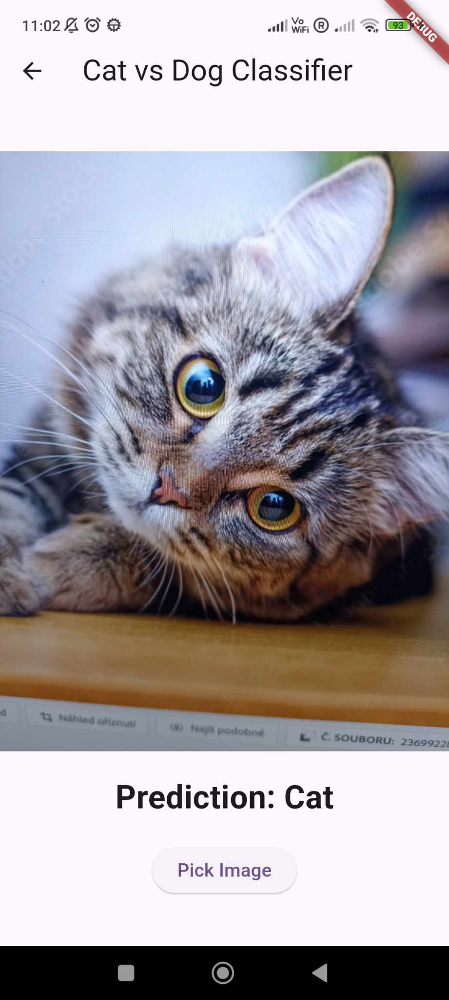

# Animals Recognizer App

## Dog vs Cat Image Classifier

This Flutter app uses **TensorFlow Lite** to classify images of dogs and cats. With the power of machine learning, the app allows users to upload or capture a photo, and it will predict whether the image is of a **dog** or a **cat**. The app leverages a pre-trained TensorFlow Lite model to perform inference directly on the device, offering a fast and efficient experience.

### Features:
- **Image Classification**: Classifies images of cats and dogs.
- **Real-time Inference**: Utilizes TensorFlow Lite to run the machine learning model directly on the device, ensuring minimal latency and offline functionality.
- **Camera Integration**: Take pictures directly from the app and classify them in real-time.
- **Image Gallery**: Choose images from the gallery and classify them instantly.

### Technologies Used:
- **Flutter**: The app is built using Flutter, ensuring it runs on both Android and iOS devices.
- **TensorFlow Lite**: Used for on-device machine learning inference.
- **Dart**: The primary programming language used for app development.

### Prerequisites:
- **Flutter SDK** installed on your local machine.
- A **TensorFlow Lite model** file (e.g., `model.tflite`) trained for cat vs dog classification.
- Device with camera and gallery access (for capturing and selecting images).

### Setup:
1. Clone the repository:
   ```bash
   git clone <repository name>
   cd dog-cat-classifier
   ```

2. Install dependencies:
   ```bash
   flutter pub get
   ```

3. Place your **TensorFlow Lite model** (`model.tflite`) in the appropriate directory.

4. Run the app:
   ```bash
   flutter run
   ```

### How It Works:
- The app allows users to either capture an image using the camera or choose one from their device’s gallery.
- The image is pre-processed and passed into a TensorFlow Lite model to predict if the image contains a dog or a cat.
- The result is displayed to the user, along with the model’s confidence score.

### Screenshots:

## Screenshots

<div style="display: flex; justify-content: space-between;">
  
  
</div>


### Future Improvements:
- **Additional Categories**: Extend the model to classify more than just dogs and cats.
- **User Interface Enhancements**: Improve UI design for a smoother experience.
- **Model Optimization**: Improve the model for higher accuracy and faster inference.
